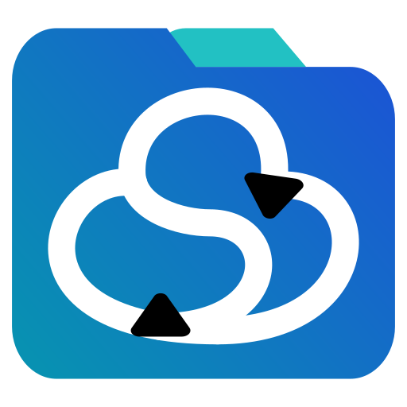

  

<h1 align="center">SomeDrive - Linux-First Desktop Client for Microsoft OneDrive</h1>

Simple GUI-first Microsoft OneDrive sync for Linux.

  
  
  

  

SomeDrive is a Linux-first Microsoft OneDrive desktop client with account-first controls, in-app sign-in, per-account pause/resume, and detailed sync diagnostics.

It exists because most Linux OneDrive tools are still command-line-heavy or awkward to install across different distributions. I wanted a straightforward desktop experience similar to what people expect on Windows: download it, install it, sign in, and sync.

## Install

Download the latest release here:

- **[Download Latest Release](https://github.com/jackbrumley/somedrive/releases/latest)**

Planned package options:

- Linux (Debian/Ubuntu): `.deb`
- Linux (Fedora/RHEL): `.rpm`
- Linux (Portable): `.AppImage`

## Getting Started

1. **Launch SomeDrive**
   - Open the app and start from the accounts home screen.
2. **Add your account**
   - Click **Add Account**, choose personal or business, and complete Microsoft sign-in.
3. **Confirm your sync root**
   - Default per-account sync root is `~/SomeDrive/<profile-slug>/`.
4. **Start syncing**
   - Use per-account sync control to start/pause/resume as needed.
5. **Check activity and logs**
   - Open account activity and session logs for detailed sync diagnostics.

## Features

- **Multi-Account by Design** - Manage personal, business, and additional accounts in one app.
- **In-App Microsoft Sign-In** - Interactive authentication flow without manual token handling.
- **Per-Account Sync Control** - Start, pause, and resume each account independently.
- **Persistent Sync State** - Per-account state and sync metadata stored under `~/.config/somedrive/`.
- **Detailed Diagnostics** - Session logs include cycle-level and file-level sync activity with account prefixes.
- **Clean Desktop UI** - Account-first navigation with clear status, activity, and settings pages.

## Why This Project Exists

I still use Windows for work and wanted that same level of simplicity on Linux for OneDrive: no setup maze, no command memorization, no terminal dependency.

SomeDrive is built to do what it says on the tin:

- install quickly,
- connect your account in-app,
- sync files reliably,
- and show clear status in a GUI so you always know what is happening.

---

## The Philosophy

SomeDrive is built around a simple idea: sync software should feel clear, predictable, and user-controlled.

- **No Terminal Required** - Everyday account, auth, and sync workflows are in-app.
- **Clarity First** - Logs and status are explicit so issues are debuggable without guesswork.
- **Account Ownership** - Each account has independent sync state and controls.
- **Linux-First Delivery** - Prioritize Linux packaging and behavior while keeping architecture portable.

## Screenshots

_Work in progress._

---

## How to Build It Yourself

1. **Open terminal in the project folder**
2. **Install dependencies**
   - Run: `npm install`
3. **Run development build**
   - Run: `npm run tauri:dev`
4. **Build release packages**
   - Run: `npm run tauri:build`
5. **Find output artifacts**
   - `src-tauri/target/release/bundle/`

## Known Issues

- Linux packaging availability depends on host tooling (`rpmbuild`, `appimagetool`) when building bundles locally.
- Microsoft app registration/auth configuration may need project-owned tenant/app settings for all target account types.
- Project is in active development, so UX and storage schema may continue to evolve quickly.

---

## Technology

- **Tauri** - Desktop framework.
- **Rust** - Backend sync/auth/runtime engine.
- **Preact + TypeScript** - Frontend UI and typed runtime state.
- **Vite + npm** - Frontend tooling and scripts.
- **Microsoft Graph** - OneDrive API integration.

---

## License

This project is licensed under the GNU General Public License v3.0 (GPLv3) - see the [LICENSE](LICENSE) file for details.

---

[Report Bug](https://github.com/jackbrumley/somedrive/issues) • [Request Feature](https://github.com/jackbrumley/somedrive/issues)

